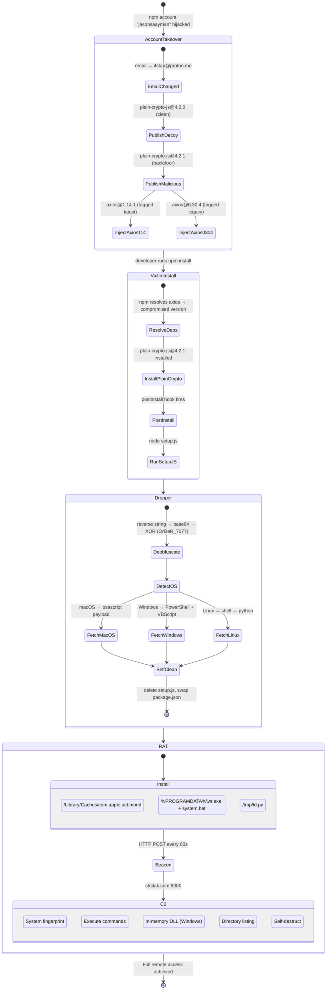
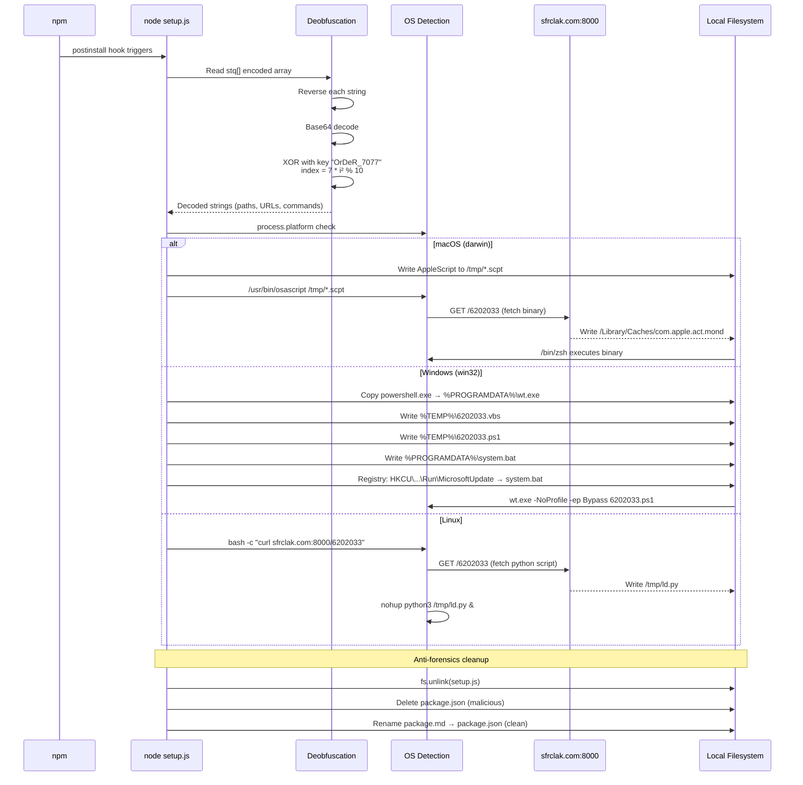
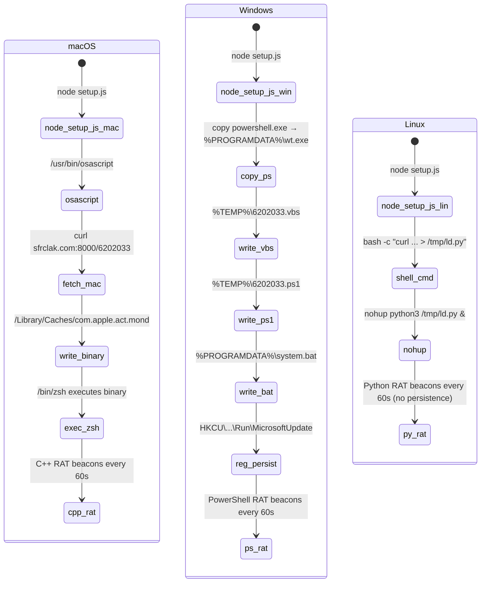
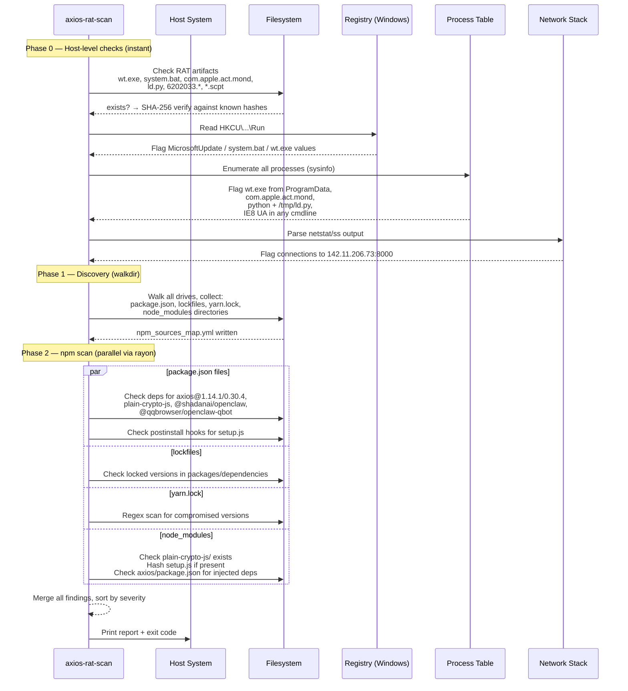

# Attack Flow — Axios Supply Chain RAT

## Kill Chain Overview



---

## Dropper Execution Sequence (setup.js)



---

## C2 Beacon Protocol

```mermaid
sequenceDiagram
    participant RAT as RAT (victim)
    participant C2 as sfrclak.com:8000

    Note over RAT: Generate 16-char random UID

    RAT->>C2: HTTP POST /6202033<br/>User-Agent: mozilla/4.0 (compatible; msie 8.0; windows nt 5.1; trident/4.0)<br/>Body: Base64(JSON { type: "FirstInfo", uid, hostname, os, arch })
    C2-->>RAT: 200 OK (acknowledged)

    loop Every 60 seconds
        RAT->>C2: HTTP POST /6202033<br/>Body: Base64(JSON { type: "BaseInfo", uid, ... })
        
        alt No pending commands
            C2-->>RAT: 200 OK (empty)
        else Command: runscript
            C2-->>RAT: { cmd: "runscript", script: "..." }
            RAT->>RAT: Execute script via shell
            RAT->>C2: POST { type: "CmdResult", rsp_runscript: "..." }
        else Command: rundir
            C2-->>RAT: { cmd: "rundir", path: "..." }
            RAT->>RAT: Enumerate directory
            RAT->>C2: POST { type: "CmdResult", rsp_rundir: [...] }
        else Command: peinject (Windows only)
            C2-->>RAT: { cmd: "peinject", dll: "<base64 DLL>" }
            RAT->>RAT: Load DLL in-memory
            RAT->>C2: POST { type: "CmdResult", rsp_peinject: "ok" }
        else Command: kill
            C2-->>RAT: { cmd: "kill" }
            RAT->>RAT: Self-destruct
            RAT->>C2: POST { type: "CmdResult", rsp_kill: "ok" }
        end
    end
```

---

## Platform Execution Chains



---

## Detection Points

```mermaid
stateDiagram-v2
    state Detection {
        [*] --> Supply_Chain
        [*] --> Host_Artifacts
        [*] --> Runtime_Signals
        [*] --> Network_Indicators

        state Supply_Chain {
            pkg_json: package.json lists plain-crypto-js
            lockfile: lockfile pins axios 1.14.1 or 0.30.4
            nm_dir: node_modules/plain-crypto-js exists
            setup: setup.js SHA256 matches e10b1fa8...
        }

        state Host_Artifacts {
            mac_file: /Library/Caches/com.apple.act.mond
            win_file: %PROGRAMDATA%\\wt.exe + system.bat
            lin_file: /tmp/ld.py
            tmp_file: $TMPDIR/6202033
            reg_key: Registry Run\\MicrosoftUpdate
            vbs_file: %TEMP%\\6202033.vbs
        }

        state Runtime_Signals {
            process: RAT process running (wt.exe / com.apple.act.mond / python ld.py)
            user_agent: IE8/WinXP UA string on any platform
            node_child: node → shell → curl/wget chain
            ps_flags: powershell -NoProfile -ep Bypass
        }

        state Network_Indicators {
            c2_ip: TCP connection to 142.11.206.73
            c2_domain: DNS lookup for sfrclak.com
            c2_port: Egress on port 8000
            beacon: HTTP POST every 60s, base64 JSON body
            fake_ua: User-Agent mozilla/4.0 msie 8.0 windows nt 5.1
        }
    }
```



---

## What the Scanner Checks (mapped to attack stages)



---

## Attribution Context

```
WAVESHAPER backdoor (Mandiant)
    └── UNC1069 (DPRK-linked threat cluster)
         └── axios supply chain attack (2026-03-31)
              ├── axios@1.14.1 (sha: 2553649f...)
              ├── axios@0.30.4 (sha: d6f3f62f...)
              ├── plain-crypto-js@4.2.1 (sha: 07d889e2...)
              ├── @shadanai/openclaw (4 versions)
              └── @qqbrowser/openclaw-qbot@0.0.130
```

---

## IOC Quick Reference

| Type | Value |
|---|---|
| C2 Domain | `sfrclak[.]com` |
| C2 IP | `142.11.206[.]73` |
| C2 Port | `8000` |
| C2 Endpoint | `/6202033` |
| User-Agent | `mozilla/4.0 (compatible; msie 8.0; windows nt 5.1; trident/4.0)` |
| XOR Key | `OrDeR_7077` (index: `7 * i² % 10`) |
| setup.js SHA-256 | `e10b1fa84f1d6481625f741b69892780140d4e0e7769e7491e5f4d894c2e0e09` |
| macOS RAT SHA-256 | `92ff08773995ebc8d55ec4b8e1a225d0d1e51efa4ef88b8849d0071230c9645a` |
| Win PS1 SHA-256 | `ed8560c1ac7ceb6983ba995124d5917dc1a00288912387a6389296637d5f815c` |
| Win PS1 SHA-256 (alt) | `617b67a8e1210e4fc87c92d1d1da45a2f311c08d26e89b12307cf583c900d101` |
| Win BAT SHA-256 | `e49c2732fb9861548208a78e72996b9c3c470b6b562576924bcc3a9fb75bf9ff` |
| Linux RAT SHA-256 | `6483c004e207137385f480909d6edecf1b699087378aa91745ecba7c3394f9d7` |
| Linux RAT SHA-256 (alt) | `fcb81618bb15edfdedfb638b4c08a2af9cac9ecfa551af135a8402bf980375cf` |
| Registry Key | `HKCU\Software\Microsoft\Windows\CurrentVersion\Run\MicrosoftUpdate` |
