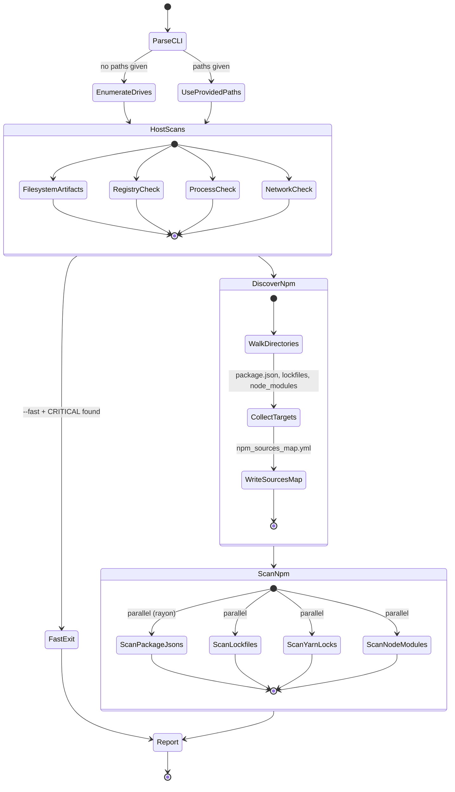

# Design — axios-rat-scan

## Purpose

A single cross-platform Rust binary that scans all mounted drives for evidence of the axios supply chain RAT (disclosed 2026-03-31). Designed for incident responders and developers who need a fast, zero-dependency answer to "am I affected?"

## Architecture

```
main.rs              CLI entry + drive enumeration + orchestration
iocs.rs              All IOC constants (hashes, versions, paths, domains)
report.rs            Finding model, severity levels, text/JSON output
scanner/
  filesystem.rs      Platform-specific RAT artifact + hash checks
  npm.rs             package.json / lockfile / node_modules scanning
  registry.rs        Windows registry persistence (cfg(windows))
  process.rs         Running process inspection via sysinfo
  network.rs         Active TCP connection checks via netstat/ss
```

## Scan Flow



## Two-Phase Discovery + Scan

1. **Discovery** — single `walkdir` pass collects all `package.json`, lockfiles, `yarn.lock`, and `node_modules` paths. Also builds the `npm_sources_map.yml` inventory. This avoids redundant filesystem walks.

2. **Scan** — all discovered targets are scanned in parallel via `rayon`. Each scan function is pure (takes a path, returns findings) making it trivially parallelizable.

## Cross-Platform Strategy

| Concern | Windows | macOS | Linux |
|---|---|---|---|
| Drive enumeration | A:-Z: drive letters | `/` + `/Volumes/*` | `/proc/mounts` |
| RAT artifacts | `%PROGRAMDATA%\wt.exe`, `system.bat` | `/Library/Caches/com.apple.act.mond` | `/tmp/ld.py` |
| Persistence | Registry Run key | — | — |
| Process names | `wt.exe` from ProgramData | `com.apple.act.mond` | `python` + `/tmp/ld.py` |
| Network | `netstat -n -o` | `netstat -tnp` | `netstat -tnp` / `ss -tnp` |

Platform-specific code uses `#[cfg(windows)]` / `#[cfg(target_os = "...")]` compile gates — no runtime feature detection, no dead code on each platform.

## Performance

- **walkdir** for fast recursive traversal with `filter_entry` to prune early
- **rayon** for parallel scanning of all discovered targets
- `node_modules` directories are not recursed — only checked for specific malicious packages at the top level
- SHA-256 hashing is only performed on files that match known artifact paths/names
- Skip list prunes `.git`, `Windows`, `System Volume Information`, `$RECYCLE.BIN`

## Output Modes

- **Text** (default): colored severity tags, one finding per block, summary with remediation steps
- **JSON** (`--json`): array of finding objects for pipeline integration
- **npm_sources_map.yml**: YAML inventory of all discovered npm projects with lockfile/node_modules status

## Exit Codes

- `0` — no critical findings
- `1` — one or more critical findings detected
