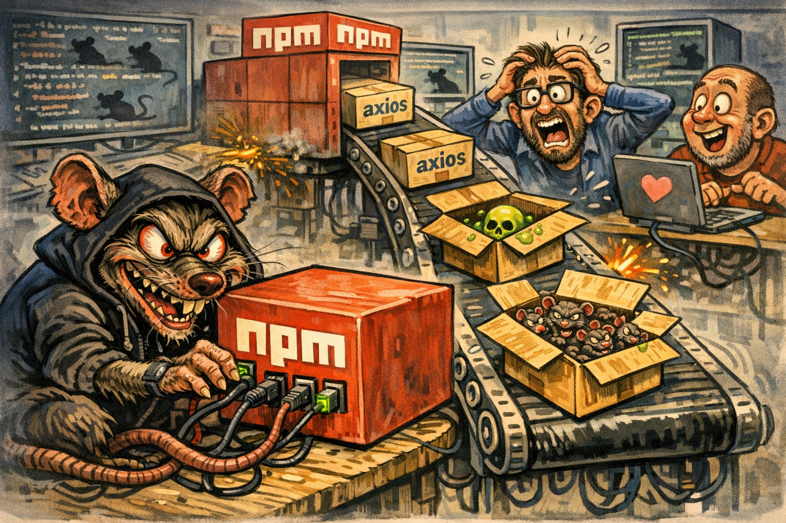

# .axios-rat-catcher

Cross-platform scanner for the [axios supply chain RAT](https://www.elastic.co/security-labs/axios-one-rat-to-rule-them-all) (2026-03-31). Single static binary, no dependencies.

Compromised versions `axios@1.14.1` and `axios@0.30.4` inject `plain-crypto-js@4.2.1`, which drops a cross-platform RAT attributed to DPRK/UNC1069 (WAVESHAPER).

~100 million weekly downloads affected. Installation to full compromise: ~15 seconds.

## Download

**[Latest release](https://github.com/brianclaridge/.axios-rat-catcher/releases/latest)**

| Platform | Binary |
|---|---|
| Windows x64 | `axios-rat-scan-x86_64-pc-windows-msvc.zip` |
| macOS Intel | `axios-rat-scan-x86_64-apple-darwin.tar.gz` |
| macOS Apple Silicon | `axios-rat-scan-aarch64-apple-darwin.tar.gz` |
| Linux x64 (static) | `axios-rat-scan-x86_64-unknown-linux-musl.tar.gz` |

## Usage

```bash
# Scan all mounted drives (auto-detected)
axios-rat-scan

# Scan specific paths
axios-rat-scan /path/to/projects

# JSON output (with scan metadata) for pipelines
axios-rat-scan --json

# Stop at first critical finding
axios-rat-scan --fast

# Filesystem only (skip process/network checks)
axios-rat-scan --no-process

# Custom report path
axios-rat-scan --report /tmp/scan-results.txt

# Control parallelism
axios-rat-scan -j4
```


## What it checks

| Phase | What |
|---|---|
| **Host artifacts** | RAT files (`wt.exe`, `system.bat`, `com.apple.act.mond`, `/tmp/ld.py`), temp dropper files (`6202033.*`), SHA-256 hash verification |
| **Registry** | `HKCU` + `HKLM` Run/RunOnce keys for `MicrosoftUpdate` persistence, script-in-temp persistence (Windows) |
| **Processes** | Running RAT processes, parent-child chains (node->shell->curl), renamed binary proxy, `osascript` dropper, spoofed IE8 User-Agent, C2 domains in cmdlines |
| **Network** | TCP connections to C2 (`142.11.206.73:8000`, `sfrclak.com`, `packages.npm.org`), DNS cache inspection, hosts file tampering. External commands use hardened absolute paths. |
| **npm packages** | `package.json`, `package-lock.json`, `yarn.lock`, `pnpm-lock.yaml` for compromised axios versions, `plain-crypto-js`, secondary vectors |
| **Lockfile integrity** | `"integrity"` and `"resolved"` fields checked against known compromised package shasums |
| **node_modules** | Installed malicious packages, injected deps in axios, `setup.js` dropper with hash check |

## Elastic Detection Rule Coverage

Based on [Elastic Security Labs detection rules](https://www.elastic.co/security-labs/axios-supply-chain-compromise-detections):

- Curl or Wget Spawned via Node.js
- Process Backgrounded by Unusual Parent
- Execution via Renamed Signed Binary Proxy
- Suspicious URL as argument to Self-Signed Binary
- Suspicious String Value Written to Registry Run Key
- Startup Persistence via Windows Script Interpreter

## Security

- External commands use absolute paths (`/usr/bin/netstat`, `C:\Windows\System32\netstat.exe`) to prevent PATH hijacking
- JSON parsing limited to 10MB to prevent OOM on malicious files
- `walkdir` follows no symlinks to prevent traversal attacks
- Scanner never executes scanned files — only reads and hashes

## Testing

```bash
# Run integration tests in Docker (builds Linux binary, scaffolds ~350 projects with 4 infected)
task test
```

22 assertions, 33 critical findings detected, zero false positives.

## Outputs

- **Terminal**: colored tree view, animated progress, findings with severity tags
- **JSON** (`--json`): metadata-wrapped output with `version`, `scan_duration_ms`, `dirs_scanned`, `findings[]`
- **REPORT.txt**: auto-generated with all findings + deduplicated affected paths for copy/paste
- **npm_sources_map.yml**: YAML inventory of all discovered npm projects

## Build from source

```bash
cargo build --release
```

## References

- [Elastic: Axios, One RAT to Rule Them All](https://www.elastic.co/security-labs/axios-one-rat-to-rule-them-all)
- [Elastic: Detection Rules](https://www.elastic.co/security-labs/axios-supply-chain-compromise-detections)
- [CHANGELOG.md](CHANGELOG.md) — version history
- [REMEDIATION.md](REMEDIATION.md) — incident response playbook
- [ATTACK_FLOW.md](ATTACK_FLOW.md) — kill chain + sequence diagrams
- [DESIGN.md](DESIGN.md) — scanner architecture + Elastic rule mapping


